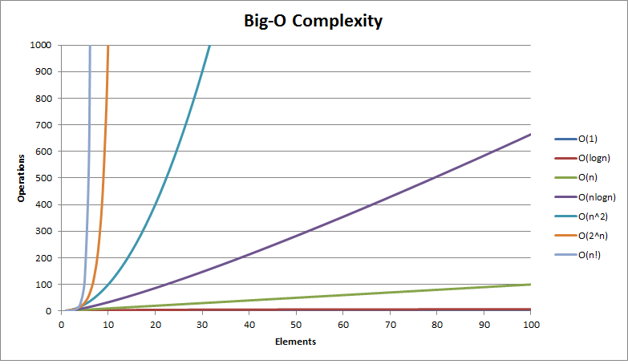
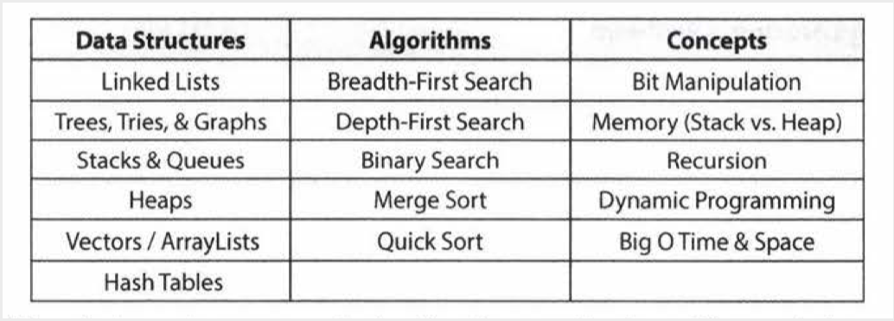

## CodeForces Problems

This repository contains solutions to popular Codeforces problems. I was initially contributing to the Daily-Coding-Problems repository for my daily practice. It created by my colleague, for but updates on it were slow due to everyones busy schedule and commits to a forked repository don't count as contributions to Github. Most competitive programmers have terrible coding practices born out of the need to finish the code as fast as possible and the fact that you don’t expect someone else to read the code—— things like not using proper indentation or variable names. I will try my best to keep my code as readable as possible.

C++ is by far the the most popular language of choice for competitive programmers across the world as it is usually faster than Java and Python, and most of the resources are available in C++. I haven't coded much in C++, and I am not really doing this competitively, so I will stick to Python. Python is an amazingly user friendly language, the only flaw that it possesses is that is slow. Unless the problem I am solving has strict memory and time constraints, Python's speed should not be an issue. Also, pointers in C/C++ can be hard to implement and debug, and memory management can also be a big headache. Still, I will code in C++ for practice and keeping in touch with the fundamentals.

	  ios_base::sync_with_stdio(false); cin.tie(0); cout.tie(0);

By placing the following line at the start of your main method, you can toggle off synchronization of all the C++ standard streams with their corresponding standard C streams before the program performs its first input or output operation. As the property is true by default, we have to explicitly set it to false to avoid this synchronization. And tie() is a method which simply guarantees the flushing of std::cout before std::cin accepts an input. This is useful for interactive console programs which require the console to be updated constantly but also slows down the program for large I/O. It is worth mentioning that I/O processing with cin and cout can be slow as opposed to using scanf and printf. Also to print a newline, using endl can make the program slow as it forces a flushing stream, so its better to use "\n". 

The problems generally contain long stories about some people and what not. You don’t need these to solve the problem. Read the input/output formats and constraints very carefully. Understand what is asked and what is given in problem and get a brute-force solution first and optimize later. Solve for the base case first, and then look for edge cases. Analyzing your algorithm is pretty crucial in competitive programming. 

The efficiency of algorithms are generally measured in Time Complexity and Space Complexity. 

It is very possible for O(N) code to run faster than 0(1) code for specific inputs. Big 0 just describes the rate of increase. For this reason, we drop the constants in runtime. An algorithm that one might have described as 0(2N) is actually O(N). And if it only goes through half of the array (in terms of iterations) does not impact the big 0 time. You should drop the non-dominant terms-— O(N^2 + N) becomes O(N^2). For example, the expression O(B^2+A) cannot be reduced without some special knowledge of A and B.

Most interviewers won't ask about specific algorithms for binary tree balancing or other complex algorithms. Frankly, being several years out of school, they probably don't remember these algorithms either. You're usually only expected to know the basics. Here's a list of the absolute, must-have knowledge— 

Practicing implementing the data structures and algorithm (on paper, and then on a computer) is also a great exercise. It will help you learn how the internals of the data structures work, which is important for many interviews.

